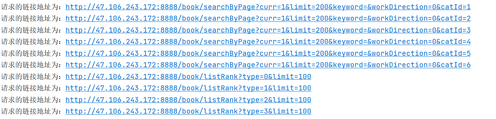

# 1. 前言
拟定在这个项目中爬取[小说精品屋](http://47.106.243.172:8888/book/bookclass.html)的小说数据。为接下来的小说`App`提供后台数据内容。当然无论是爬虫项目、后台项目或者是小说`App`项目，仅用于学习目的。

# 2. 开发历程记录

|        日期        |             说明             |
| :----------------: | :--------------------------: |
| `2022`年`5`月`4`日 | 想法产生、简单分析和部分编码。 |
|  `2022`年`5`月`5`日  | 整理代码部分逻辑、编码，完成排行榜四种类型的数据前`100`条的获取。 |
| `2022`年`5`月`5`日 `18:25:34` | `Done`！已经可以完成部分数据的获取，即排行榜四种类型前``100`条数据，“全部作品”`200`条数据。感觉现阶段爬取的小说数据够用了，所以不再考虑分页爬取所有数据了。 |

## 2.1 简单分析

简单分析发现，和现象的`xpath`方式查找`html`元素略有区别，因为这个网站直接使用了`ajax`来获取到`json`数据。也就是直接可以获取到我所需要的数据，而我只需要将其下载下载即可。下面做一个简单的整理：

| 序号     | 链接                                                         | 说明                                                         |
| -------- | ------------------------------------------------------------ | ------------------------------------------------------------ |
| 排行榜   | http://47.106.243.172:8888/book/listRank?type=0&limit=30     | `tpye`表示排行榜类型：`0`表示点击榜、`1`表示新书榜、`2`表示更新榜、`3`表示评论榜；`limit`表示每页加载多少条数据； |
| 全部作品 | http://47.106.243.172:8888/book/searchByPage?curr=1&limit=20&keyword=&workDirection=0&catId=1 | `curr`和`limit`表示当前第几页，每页多少条；`keyword`表示输入的关键字，可以省略；`workDirection`表示作品频道，`0`为男频，`1`为女频；`catId`表示作品分类，`0`表示玄幻奇幻、`1`表示武侠仙侠、`2`表示都市言情、`3`表示历史军事、`4`表示科幻灵异、`5`表示网游竞技； |

对于拿到的数据以`json`格式存储，这里我取一条数据出发，继续看每个记录的后续，比如：

```json
{
    "id":"1334317856465199104",
    "workDirection":null,
    "catId":"1",
    "catName":"玄幻奇幻",
    "picUrl":"/localPic/2020/12/03/4526d811206a4fe0941145a043a10605.jpg",
    "bookName":"倾世仙妃天才召唤师",
    "authorId":null,
    "authorName":"君沐烟",
    "bookDesc":"    一朝陨落，转世神童，遇上二货师傅，敛尽天下奇物！炼神丹，召万兽，唤万灵！<br/><br/>    一步步成为世人高攀不起的存在！我的男人，要么比我强悍，要么比我聪明，否则凭什么征服我！",
    "score":"6.0",
    "bookStatus":"0",
    "visitCount":null,
    "wordCount":"115785",
    "lastIndexId":"1337752904921034752",
    "lastIndexName":"第三十章 师兄灵宗二阶了",
    "lastIndexUpdateTime":"12/12 21:35",
    "isVip":null,
    "status":null,
    "updateTime":null,
    "createTime":null,
    "crawlSourceId":null,
    "crawlBookId":null,
    "crawlLastTime":null,
    "crawlIsStop":null
}
```

可以得到小说名字、分类、图片、作者、字数等信息。接下来进入详情界面：

即：http://47.106.243.172:8888/book/1334317856465199104.html

也就是把`id`评价了`.html`作为链接地址。进入该链接后该网站`js`脚本检查了一下用户是否登录，但对阅读不影响。然后还是通过`json`返回最新章节的一点内容，这里不需要。主要的是要进入阅读的界面。分析发现，“点击阅读”的这个按钮的事件响应来自拼接，比如这里在`html`页面中写入了：

```html
<body>
    <input type="hidden" id="lastBookIndexId" value="1337752904921034752"/>
    <input type="hidden" id="bookCatId" value="1"/>
    <input type="hidden" id="bookId" value="1334317856465199104"/>
    <input type="hidden" id="preContentId" value="1334317866569277440"/>
    ...
</body>
```

“点击阅读”的链接拼接为：http://47.106.243.172:8888/book/1334317856465199104/1334317866569277440.html

终于看见了内容，该网站在处理显示内容的时候，又使用了将内容写入到`html`中的方式，个人感觉应该是因为排版的原因，应该是上传的时候小说创作者就使用的是富文本编辑器，所以可以获取到`html`格式化的文本内容，也更利于后期的网站渲染。比如这里为：

```html
<div class="txtwrap">
<div id="showReading" class="readBox" style="font-size: 16px; font-family: microsoft yahei">&nbsp;&nbsp;&nbsp;&nbsp;冷<br/><br/>&nbsp;&nbsp;&nbsp;&nbsp;身上的温度正缓慢的流失......<br/><br/>&nbsp;&nbsp;&nbsp;&nbsp;生命随着体温的流失也逐渐开始流逝......<br/><br/>&nbsp;&nbsp;&nbsp;&nbsp;就在这不知何年何时何地的一片阴冷之中，一道道悦耳的旋律闯入了这刺骨之地，打破了原有的阴冷，周围开始慢慢暖和了起来，这一段平平淡淡却又温暖的旋律不停的在凤云倾的脑海中回响着。<br/><br/>&nbsp;&nbsp;&nbsp;&nbsp;随着周围温度的升温，凤云倾的意识缓缓的恢复了过来。<br/>
	...
&nbsp;&nbsp;&nbsp;&nbsp;可他却失算了，因为她姐姐的夫君萧王爷也一直心心念念着白念雪，那她怎可能咽的下这一口气？<br/><br/>&nbsp;&nbsp;&nbsp;&nbsp;目前这种情况白念雪实力虽然强悍，但却因为有孕在身，不宜使用武力，否则很容易动了胎气流产这样她小命可就不保了。</div>
</div>
```


## 2.2 结果

不考虑分页，仅获取“全部作品”`200`条数据，排行榜`100`条 数据，即如下链接：



但是，我在程序中没有处理图片问题，没有将其下载下来（这里的图片指的是封面）。但，由于小说数远远小于章节数目，所以这里考虑之后再单独写一个程序来下载图片，并保存其链接地址和本地图片地址的对应关系。在爬虫程序中不做添加。

